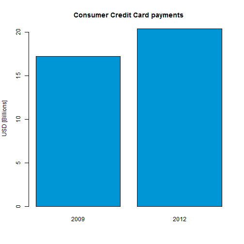

Creditapp Pitch
========================================================
author: Juan Orozco
date: July 26th, 2014

Motivation
========================================================

Society is becoming increasingly dependent on using credit
to make purchases and decisions. These days, good credit
is used for more than just getting a credit card or loan.
More and more business are making the case that you must
have good credit before they extend products or services to
you.

Motivation
========================================================

When applying for credit, lenders will check your credit
score to see how good it is. Your credit score is used to
determine whether you can get credit for things like:
* credit card
* finance your college tuition
* buy a house or car
* start up a new business

Creditapp
========================================================

Creditapp is aimed to people who want to know beforehand
their likelihood of getting a loan, given the information they
provide. The algorithm, which is based on a decision tree, will
predict payment behaivour either as `Good` or `Bad`. 

Even if you scored badly, it still may be possible for lenders to
give you a loan, provided your credit score is not too low. But be
aware that you may pay a higher interest rate and more fees since
you are more likely to default-fail to pay the loan back.

How It Works
========================================================

1. Go to `orojuan.shinyapps.io/creditapp` to access Creditapp.
2. Enter your Profile.
3. Click `Submit` Button to see your predicted payment behaviour.

**NOTE:** You can go to the documentation tab should you need any help.

**Legal Disclaimer:** The results hereby provided are just for
informational purposes and hence must not be used to demand a loan
since they may differ from actual scores.

